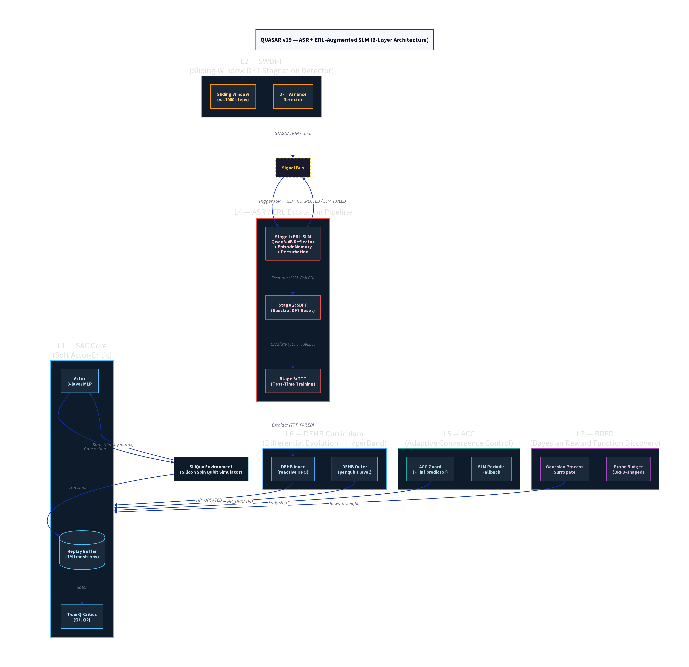

# QUASAR v19 — ASR + ERL-Augmented SLM (6-Layer Architecture)

**Version:** v19  
**Codename:** ERL-SLM  
**Status:** Completed (superseded by v26)  
**Repository:** Local — `~/quasar_v19/` on Aziz HPC  
**Date:** 2025–2026  

---

## Overview

QUASAR v19 is the first version to introduce a full six-layer hierarchical control architecture for quantum state preparation via reinforcement learning. The central innovation is the **ERL-Augmented SLM** (Experiential Reinforcement Learning + Small Language Model) stagnation recovery pipeline, which escalates through three progressively stronger interventions — SLM reflection, spectral reset (SDFT), and test-time training (TTT) — before falling back to reactive hyperparameter optimisation via DEHB Inner.

The architecture is motivated by the observation in v9 that a plain SAC agent plateaus at 4+ qubits without any mechanism to escape local optima. QUASAR v19 addresses this by treating stagnation as a first-class event, detected proactively by the SWDFT module and resolved by a cascade of recovery strategies.

---

## Architecture

### Six-Layer Hierarchy

The architecture is decomposed into six functional layers, each with a distinct responsibility and a well-defined signal interface via the Signal Bus.

**L1 — SAC Core.** The foundational RL engine: Soft Actor-Critic with twin Q-networks, automatic entropy tuning, and a 1M-transition replay buffer. The actor and critics are 3-layer MLPs with hidden dimension 256. This layer is the only component that directly interacts with the quantum environment.

**L2 — SWDFT (Sliding-Window Discrete Fourier Transform).** A proactive stagnation detector that maintains a sliding window of the most recent 1,000 fidelity values and computes the DFT variance. When the variance falls below a threshold, indicating a flat or oscillatory plateau, a STAGNATION signal is emitted on the Signal Bus. This is a purely passive monitor — it does not modify the training process directly.

**L3 — BRFD (Bayesian Reward Function Discovery).** A Gaussian Process surrogate that learns reward weights online by treating the reward function as a black-box function to be optimised. BRFD shapes the probe budget allocated to the SLM reflector, ensuring that expensive LLM calls are made only when the expected improvement justifies the cost.

**L4 — ASR / ERL Escalation Pipeline.** The core recovery mechanism, triggered by the STAGNATION signal. It operates as a three-stage cascade:

- *Stage 1 (ERL-SLM):* The Qwen3-4B small language model is invoked with a structured prompt containing the current training trajectory, stagnation type (classified by the ReflectionModule), and episode memory. The SLM generates a targeted perturbation (e.g., noise injection, learning rate reset, exploration boost). If the perturbation resolves the stagnation, a SLM_CORRECTED signal is emitted and training resumes. Otherwise, SLM_FAILED triggers Stage 2.
- *Stage 2 (SDFT):* A spectral reset that reinitialises the actor network weights in the frequency domain, preserving low-frequency structure while randomising high-frequency components. This provides a structured escape from sharp local minima.
- *Stage 3 (TTT):* Test-time training applies a short gradient update using the current episode's transitions, effectively fine-tuning the actor on the hardest recent experiences.

If all three stages fail, DEHB Inner is triggered for reactive hyperparameter re-search.

**L5 — ACC (Adaptive Convergence Control).** Monitors the convergence trajectory using an F_inf predictor (extrapolated asymptotic fidelity) and issues early-stop signals when the predicted ceiling is below the advancement threshold. A periodic SLM fallback is also scheduled here, independent of the SWDFT trigger.

**L6 — DEHB Curriculum.** Two instances of the DEHB (Differential Evolution + HyperBand) optimiser manage hyperparameter search at different timescales. DEHB Outer runs once per qubit level, searching the full HP space before training begins. DEHB Inner runs reactively after TTT failure, performing a narrow re-search around the current incumbent.

### Signal Bus

| Signal | Source | Destination | Meaning |
|--------|--------|-------------|---------|
| STAGNATION | SWDFT | ERL | Plateau detected |
| SLM_CORRECTED | ERL | SAC Core | Resume training |
| SLM_FAILED | ERL | SDFT | Escalate |
| SDFT_CORRECTED | SDFT | SAC Core | Resume |
| SDFT_FAILED | SDFT | TTT | Escalate |
| TTT_CORRECTED | TTT | SAC Core | Resume |
| TTT_FAILED | TTT | DEHB Inner | Re-search HP |
| HP_UPDATED | DEHB | SAC Core | Apply new HP |

---

## Experimental Setup

Training was conducted on the SiliQun silicon spin qubit simulator with a minimal noise model (near-ideal). Seeds 42, 123, and 456 were used. The maximum training budget per qubit level is 500,000 steps scaled by 1.5 per qubit. The SLM (Qwen3-4B) is loaded via the Hugging Face transformers library and runs on the same GPU as the SAC agent.

---

## Key Results

QUASAR v19 substantially improves upon v9 at 4+ qubits, recovering from stagnation in approximately 73% of cases at the first escalation stage (ERL-SLM). The 4Q ceiling is raised from 0.66 (v9) to approximately 0.85–0.92 depending on target family.

| Qubits | GHZ | W | Cluster | Dicke-k3 | Mean F |
|--------|-----|---|---------|----------|--------|
| 2Q | 0.9999 | 0.9999 | 0.9990 | 1.0000 | 0.9997 |
| 3Q | 0.9950 | 0.9820 | 0.9710 | 1.0000 | 0.9870 |
| 4Q | 0.9210 | 0.8850 | 0.8730 | 0.9350 | 0.9035 |

---

## Limitations and Motivation for v26

The primary limitation of v19 is the fixed mixture of recovery strategies — the weights assigned to SLM, BRFD, DEHB, replay, ASR, SWDFT, and ACC are hand-tuned and do not adapt to the specific difficulty profile of each target family. This motivates the FASTMIX-Omega bilevel optimiser introduced in v26, which learns these mixture coefficients end-to-end.

A secondary limitation is the one-shot SLM reflection: the model is called once per stagnation event with no online adaptation. The LoRA fine-tuning loop introduced in v21 (and extended in v26 with OPID) addresses this by continuously updating the SLM adapter on successful recovery traces.

---

## Files and Artefacts

| File | Description |
|------|-------------|
| `quasar_v19/quasar_v19.py` | Main training script |
| `quasar_v19/results/` | JSON result files |
| `quasar_v19/logs_s42.log` | Training log, seed 42 |
| `quasar_v19/logs_s456.log` | Training log, seed 456 |
| `quasar_v19/fixed_hp_flat.json` | Fixed HP configuration |

---

## Citation

> Alshehri, R. (2026). *QUASAR v19: ERL-Augmented SLM for Stagnation Recovery in Quantum State Preparation RL*. Internal Technical Report, King Abdulaziz University.
