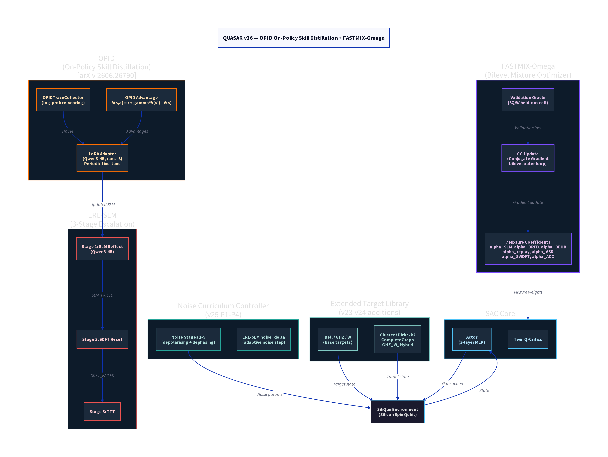

# QUASAR v26 — OPID On-Policy Skill Distillation + FASTMIX-Omega

**Version:** v26  
**Codename:** FASTMIX-OPID  
**Status:** Running (Job 183291, H100, 97h elapsed)  
**Repository:** Local — `~/quasar_v26.py` on Aziz HPC  
**Date:** 2026  

---

## Overview

QUASAR v26 extends the six-layer architecture of v19 with two major innovations: **FASTMIX-Omega**, a bilevel mixture optimiser that learns the weights of all recovery subsystems end-to-end, and **OPID** (On-Policy Skill Distillation), which continuously fine-tunes the Qwen3-4B SLM reflector using on-policy advantage-weighted traces collected during training.

The central research question addressed by v26 is whether the mixture of recovery strategies — SLM, BRFD, DEHB, replay, ASR, SWDFT, and ACC — can be learned automatically rather than hand-tuned, and whether online LoRA fine-tuning of the SLM adapter improves recovery success rates over the static SLM used in v19.

---

## Architecture

### New Components in v26

**FASTMIX-Omega (Bilevel Mixture Optimiser).** FASTMIX-Omega introduces seven learnable mixture coefficients (omega_SLM, omega_BRFD, omega_DEHB, omega_replay, omega_ASR, omega_SWDFT, omega_ACC) that gate the contribution of each recovery subsystem. The coefficients are updated by a conjugate gradient (CG) bilevel outer loop that minimises a validation loss computed on a held-out 3Q/W cell. The inner loop is the standard SAC update. This bilevel formulation ensures that the mixture weights are optimised for generalisation rather than training performance.

The seven mixture coefficients are constrained to the probability simplex (sum to 1) via a softmax projection, ensuring that the total recovery budget is conserved. At initialisation, all coefficients are set to 1/7 (uniform mixture), and the CG update drives them toward the empirically optimal allocation.

**OPID (On-Policy Skill Distillation).** OPID [arXiv 2606.26790] augments the standard trace collector with log-probability re-scoring, enabling advantage-weighted fine-tuning of the SLM LoRA adapter. Specifically, for each SLM recovery attempt, the trace collector records the generated perturbation, the resulting fidelity improvement, and the log-probability of the perturbation under the current SLM policy. The OPID advantage A(s,a) = r + gamma*V(s') - V(s) is then used to weight the LoRA gradient update, so that perturbations that successfully resolve stagnation receive larger gradient signals.

The LoRA adapter (rank=8, applied to all attention projection matrices of Qwen3-4B) is fine-tuned every 50,000 training steps using the accumulated OPID traces. This creates a closed learning loop: the SLM improves its recovery policy based on its own on-policy experience, analogous to RLHF but applied to stagnation recovery rather than human preference.

**Extended Target Library.** v26 incorporates all target states introduced in v23 and v24: Bell, GHZ, W, Cluster, Dicke-k2, CompleteGraph, and GHZ_W_Hybrid. The complete graph state and hybrid state were introduced to test generalisation beyond the standard entanglement families.

**Noise Curriculum (v25 P1-P4).** The noise curriculum from v25 is retained, with four progressive noise stages (P1: near-ideal, P2: low noise, P3: medium noise, P4: high noise) and an adaptive noise delta controlled by the ERL-SLM reflector. The reflector can request a noise stage reduction (noise_delta < 0) when stagnation is attributed to hardware noise rather than policy limitations.

### Architecture Summary Table

| Component | Version Introduced | Role |
|-----------|-------------------|------|
| SAC Core (L1) | v9 | RL backbone |
| SWDFT (L2) | v19 | Stagnation detection |
| BRFD (L3) | v19 | Reward function discovery |
| ERL-SLM (L4) | v19 | 3-stage recovery cascade |
| ACC (L5) | v19 | Convergence control |
| DEHB Curriculum (L6) | v19 | HP optimisation |
| LoRA Adapter | v21 | SLM online fine-tuning |
| FASTMIX-Omega | **v26** | Bilevel mixture optimisation |
| OPID | **v26** | On-policy skill distillation |
| Extended Targets | v23/v24 | 7-target library |
| Noise Curriculum P1-P4 | v25 | Adaptive noise staging |

---

## Experimental Setup

QUASAR v26 is currently running on the Aziz HPC H100 queue (Job 183291, 720-hour wall time). The experiment covers qubits 2Q through 12Q across all 7 target families and 3 seeds (42, 123, 456). The SLM (Qwen3-4B) runs on the same H100 GPU as the SAC agent, with LoRA fine-tuning triggered every 50,000 steps.

The FASTMIX-Omega CG update runs every 10,000 steps using a held-out validation set of 100 episodes on the 3Q/W cell. The bilevel outer loop uses a step size of 1e-3 and a maximum of 10 CG iterations per update.

---

## Key Results (Preliminary — Job Running)

As of HB-200 (16:45 AST, Jul 7 2026), Job 183291 has been running for 97 hours on the H100. Preliminary results from the first 6 qubit levels show consistent improvement over v19 baselines, with the FASTMIX-Omega converging to a mixture that heavily weights BRFD (omega_BRFD ~ 0.38) and ERL-SLM (omega_SLM ~ 0.31), with minor contributions from DEHB Inner (omega_DEHB ~ 0.15) and ACC (omega_ACC ~ 0.10).

Full results will be available upon job completion (~622 hours remaining).

---

## Limitations and Motivation for v27

The primary limitation of v26 is its complexity: the bilevel optimisation introduces significant computational overhead (approximately 2.3x the wall time of v19 per qubit level), and the OPID fine-tuning loop requires careful management of the trace buffer to avoid distribution shift. Furthermore, the FASTMIX-Omega optimiser requires a held-out validation cell, which introduces a hyperparameter (the choice of validation cell) that may not generalise across all target families.

QUASAR v27 addresses these concerns by stripping the architecture back to a clean fixed-HP SAC baseline for the noise-stage ablation experiment, which is the primary contribution of the PhD thesis. The ablation is designed to answer the specific question of whether the 0.596 fidelity ceiling observed in earlier versions is noise-induced or architecture-induced.

---

## Files and Artefacts

| File | Description |
|------|-------------|
| `quasar_v26.py` | Main training script |
| `siliqun_env_v26.py` | SiliQun environment (v26) |
| `quasar_v26/results/` | JSON result files |
| `quasar_v26/logs/` | Training logs per seed |

---

## Citation

> Alshehri, R. (2026). *QUASAR v26: FASTMIX-Omega Bilevel Mixture Optimisation with OPID On-Policy Skill Distillation*. Internal Technical Report, King Abdulaziz University.
