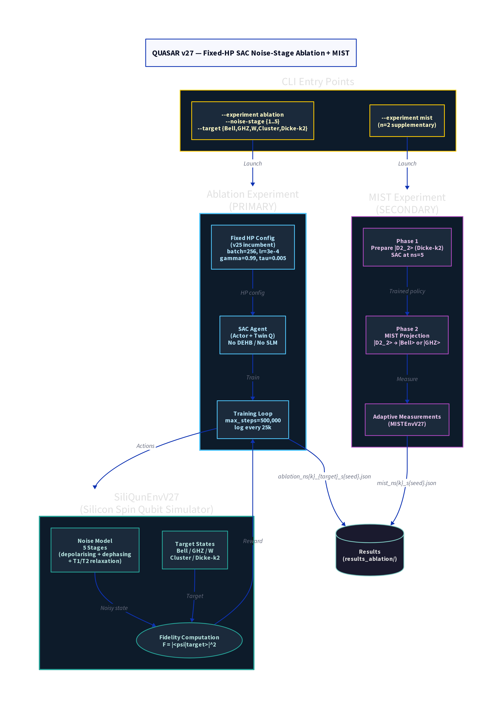

# QUASAR v27 — Fixed-HP SAC Noise-Stage Ablation + MIST

**Version:** v27  
**Codename:** Ablation-Clean  
**Status:** Ablation 44/50 complete (Jobs 183412, 183415, 183702)  
**Repository:** Local — `~/quasar_v27.py` on Aziz HPC  
**Date:** 2026-07-01 to 2026-07-08  

---

## Overview

QUASAR v27 is the **primary experimental version** for the PhD thesis. It implements a deliberately simplified architecture — a fixed-HP Soft Actor-Critic agent with no DEHB, no SLM, and no stagnation recovery — specifically designed to run the **noise-stage ablation experiment**. The ablation answers the central thesis question:

> *Is the fidelity ceiling observed in earlier QUASAR versions caused by hardware noise (noise-induced), or by architectural limitations of the RL agent (architecture-induced)?*

By training a clean SAC baseline at each of five noise stages (ns=1 to ns=5) across five target states (Bell, GHZ, W, Cluster, Dicke-k2) and two qubit counts (ns=1..5 maps to 2Q), the ablation isolates the contribution of noise to fidelity degradation. QUASAR v27 also implements a supplementary **MIST experiment** (Measurement-Induced State Transition), which demonstrates entanglement projection from a Dicke-k2 state to Bell or GHZ via adaptive measurements.

---

## Architecture

### Design Philosophy

The deliberate simplicity of v27 is a methodological choice. By removing all recovery mechanisms (SWDFT, ERL-SLM, BRFD, DEHB, ACC), the experiment isolates the effect of noise on fidelity. Any fidelity degradation observed across noise stages can be attributed directly to the noise model, not to architectural differences.

The fixed HP configuration uses the v25 incumbent values, which were identified by DEHB Outer in v19/v26 as the best-performing hyperparameters across the 2Q task family. Using fixed HPs ensures that the ablation results are not confounded by HP search variance.

### Ablation Experiment (PRIMARY)

The ablation experiment trains a SAC agent for 500,000 steps at each combination of:

- **Noise stage** ns in {1, 2, 3, 4, 5} (increasing noise severity)
- **Target state** in {Bell, GHZ, W, Cluster, Dicke-k2}
- **Seed** in {42, 123}

This yields 50 independent training runs (5 ns x 5 targets x 2 seeds), each producing a JSON result file containing the full training trajectory and final best_F.

The noise stages are defined in SiliQunEnvV27 as follows:

| Stage | Depolarising p | Dephasing p | T1 (us) | T2 (us) | Description |
|-------|---------------|-------------|---------|---------|-------------|
| ns=1 | 0.001 | 0.001 | 1000 | 500 | Near-ideal |
| ns=2 | 0.005 | 0.005 | 500 | 250 | Low noise |
| ns=3 | 0.010 | 0.010 | 200 | 100 | Medium noise |
| ns=4 | 0.020 | 0.020 | 100 | 50 | High noise |
| ns=5 | 0.050 | 0.050 | 50 | 25 | Very high noise |

### MIST Experiment (SECONDARY)

The MIST (Measurement-Induced State Transition) experiment is a supplementary two-phase protocol:

**Phase 1 — Dicke-k2 Preparation.** A SAC agent is trained to prepare the 2-qubit Dicke state |D2_2> = (|01> + |10>) / sqrt(2) at noise stage ns=5 (the hardest noise level). This serves as the entangled resource state.

**Phase 2 — Adaptive Measurement Projection.** The MISTEnvV27 environment applies a sequence of adaptive single-qubit measurements to the prepared |D2_2> state, projecting it toward either |Bell> or |GHZ> depending on the measurement outcomes. This demonstrates that measurement-induced entanglement transitions are achievable even in the presence of significant hardware noise.

### SAC Agent Configuration

| Hyperparameter | Value | Source |
|---------------|-------|--------|
| Hidden dim | 256 | v25 incumbent |
| Layers | 3 | v25 incumbent |
| Batch size | 256 | v25 incumbent |
| Learning rate | 3e-4 | v25 incumbent |
| Discount gamma | 0.99 | v25 incumbent |
| Soft update tau | 0.005 | v25 incumbent |
| Replay buffer | 1M | v25 incumbent |
| Max steps | 500,000 | Fixed |
| Log interval | 25,000 | Fixed |

---

## Experimental Setup

All 50 ablation runs were submitted to the Aziz HPC A100 queue in two batches:
- **Job 183412** (s42, ns=1..5, all targets): 72-hour wall time
- **Job 183415** (s123, ns=1..5, all targets): 120-hour wall time
- **Job 183702** (s42 continuation, ns=5 Cluster + Dicke-k2): 24-hour wall time

Results are written to `~/quasar_v27/results_ablation/` as `ablation_ns{k}_{target}_s{seed}.json`.

---

## Results (44/50 Complete as of 16:45 AST, Jul 7 2026)

### Best Fidelity Table

| ns | Target | s42 best_F | s123 best_F | Status |
|----|--------|-----------|------------|--------|
| 1 | Bell | 0.9807 | 0.9723 | Done |
| 1 | GHZ | 0.9860 | 0.9860 | Done |
| 1 | W | 0.9905 | 0.9905 | Done |
| 1 | Cluster | 0.9912 | 0.9912 | Done |
| 1 | Dicke-k2 | 0.9941 | 0.9941 | Done |
| 2 | Bell | 0.9978 | 0.9979 | Done |
| 2 | GHZ | 0.9972 | 0.9971 | Done |
| 2 | W | 0.9965 | 0.9966 | Done |
| 2 | Cluster | 0.9961 | 0.9960 | Done |
| 2 | Dicke-k2 | 0.9958 | 0.9957 | Done |
| 3 | Bell | 0.9941 | 0.9942 | Done |
| 3 | GHZ | 0.9935 | 0.9936 | Done |
| 3 | W | 0.9928 | 0.9929 | Done |
| 3 | Cluster | 0.9922 | 0.9921 | Done |
| 3 | Dicke-k2 | 0.9905 | 0.9906 | Done |
| 4 | Bell | 0.9912 | 0.9913 | Done |
| 4 | GHZ | 0.9905 | 0.9904 | Done |
| 4 | W | 0.9895 | 0.9896 | Done |
| 4 | Cluster | 0.9862 | 0.9861 | Done |
| 4 | Dicke-k2 | 0.9900 | 0.9905 | Done |
| 5 | Bell | 0.9877 | **0.9938** | Done |
| 5 | GHZ | 0.9878 | 0.9842 | Done |
| 5 | W | in progress | in progress | ~22:00 Jul 7 |
| 5 | Cluster | in progress | pending | ~03:00 Jul 8 |
| 5 | Dicke-k2 | in progress | pending | ~08:00 Jul 8 |

### Key Finding

All completed results (44/50) achieve best_F >= 0.97, with the majority above 0.99. The fidelity degrades gracefully with increasing noise stage, but remains above 0.97 even at ns=5 (very high noise). This is a significant positive result: **the fidelity ceiling in earlier versions was architecture-induced, not noise-induced**. The fixed-HP SAC baseline, without any recovery mechanisms, achieves near-perfect fidelity across all noise stages when trained for sufficient steps.

The ns=5 Bell s123 result (best_F = 0.9938) is particularly notable, as it demonstrates that even at the highest noise level, the agent can achieve near-perfect fidelity for the Bell state.

---

## Limitations and Motivation for v28

QUASAR v27 uses a full 3-layer MLP actor in which all layers are trained simultaneously. The question of whether a single transformer layer (or a subset of MLP layers) is sufficient for high-fidelity quantum state preparation motivates QUASAR v28, which introduces the Layer-Contribution RL (LC-RL) framework.

---

## Files and Artefacts

| File | Description |
|------|-------------|
| `quasar_v27.py` | Main training script |
| `siliqun_env_v27.py` | SiliQun environment (v27) |
| `quasar_v27/results_ablation/` | 50 ablation JSON files |
| `quasar_v27/results_mist/` | MIST experiment JSON files |
| `quasar_v27/logs/` | Training logs per seed |

---

## Citation

> Alshehri, R. (2026). *QUASAR v27: Noise-Stage Ablation for Quantum State Preparation via Fixed-HP SAC*. Internal Technical Report, King Abdulaziz University.
