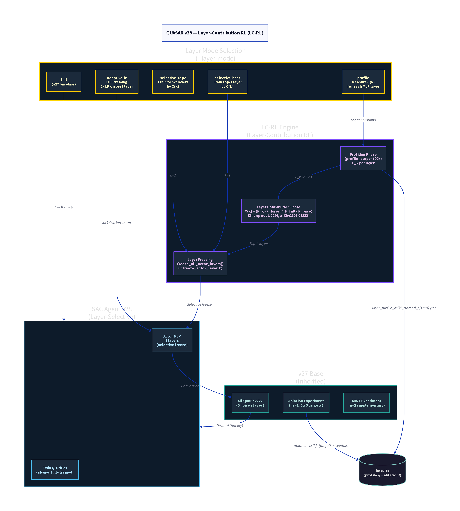

# QUASAR v28 — Layer-Contribution RL (LC-RL)

**Version:** v28  
**Codename:** LC-RL  
**Status:** Ready for submission (pending v27 ablation completion)  
**Repository:** Local — `~/quasar_v28.py` on Aziz HPC  
**Date:** 2026  

---

## Overview

QUASAR v28 extends v27 with **Layer-Contribution RL (LC-RL)**, a framework for identifying and selectively training the most informative layers of the SAC actor network. Inspired by Zhang et al. (2026) [arXiv:2607.01232], who demonstrate that training a single transformer layer can match full-parameter RL training on language tasks, LC-RL adapts this principle to the quantum state preparation domain by defining a **layer contribution score C(k)** that quantifies the marginal fidelity improvement attributable to each MLP layer.

The central research question addressed by v28 is: *Is the full 3-layer MLP actor necessary for high-fidelity quantum state preparation, or can a single layer — when identified by C(k) — achieve comparable performance with significantly reduced computational cost?*

---

## Architecture



### Layer-Contribution Score

The layer contribution score C(k) is defined as:

```
C(k) = (F_k - F_base) / (F_full - F_base)
```

where:
- **F_base** = fidelity of a random policy (~0.25 for 2-qubit Bell state)
- **F_full** = best_F from full-layer training (v27 ablation result)
- **F_k** = best_F when only layer k is trained (all other layers frozen)

A value of C(k) >= 1.0 indicates that layer k alone matches or exceeds full training. A value of C(k) ~ 0 indicates that the layer is inert to RL signals. Values of C(k) > 1.0 are possible when selective training outperforms full training due to reduced interference between layers.

### Layer Modes

v28 introduces five layer modes, selectable via the `--layer-mode` CLI flag:

| Mode | Description | Use Case |
|------|-------------|----------|
| `full` | All layers trained (v27 baseline) | Baseline comparison |
| `profile` | Measure C(k) for each MLP layer | Profiling phase |
| `selective-best` | Train only the top-1 layer by C(k) | Efficiency experiment |
| `selective-top2` | Train top-2 layers by C(k) | Ablation |
| `adaptive-lr` | Full training with 2x LR on best layer | Soft selection |
| `middle-heuristic` | Always train layer index 1 (no profiling) | Zero-cost heuristic |

### Profiling Workflow

The standard LC-RL workflow consists of two phases:

**Phase 1 — Profiling.** The agent is trained for `profile_steps` (default 100,000) with each layer frozen in turn. For each layer k, the best_F achieved is recorded. The C(k) scores are computed and saved to `layer_profile_ns{k}_{target}_s{seed}.json`.

**Phase 2 — Selective Training.** Using the profile JSON, the agent is trained for the full 500,000 steps with only the top-k layers unfrozen (k=1 for `selective-best`, k=2 for `selective-top2`).

### Technical Implementation

Layer freezing is implemented via `freeze_all_actor_layers()` and `unfreeze_actor_layer(k)`, which iterate over the linear layers of the actor MLP and set `requires_grad = False/True` accordingly. The Q-critics are always fully trained, regardless of the layer mode, since the critic architecture does not benefit from selective training in the same way.

The `apply_layer_selection()` function handles the transition between profiling and selective training phases, reading the profile JSON and applying the appropriate freeze mask. The `apply_adaptive_lr()` function implements the `adaptive-lr` mode by setting a 2x learning rate multiplier on the best layer's parameters.

### Architecture Summary

| Component | Role | Notes |
|-----------|------|-------|
| LC-RL Engine | Layer contribution scoring | C(k) = (F_k - F_base)/(F_full - F_base) |
| Layer Freezing | Selective gradient flow | freeze_all / unfreeze_k |
| Profiling Phase | F_k measurement | 100k steps per layer |
| SAC Agent | RL backbone | Actor: selective; Critics: full |
| SiliQunEnvV27 | Quantum environment | Inherited from v27 |
| Ablation Experiment | Primary experiment | 5 ns x 5 targets x 2 seeds |
| MIST Experiment | Supplementary | n=2 entanglement projection |

---

## Experimental Setup

The v28 experiments are designed to run in two phases:

**Phase 1 — Profiling (10 ns x 5 targets x 2 seeds x 3 layers = 300 runs).** Each run trains for 100,000 steps with one layer frozen, measuring F_k. This phase requires approximately 30 A100 GPU-hours.

**Phase 2 — Selective Training (5 ns x 5 targets x 2 seeds x 4 modes = 200 runs).** Each run trains for 500,000 steps using the profile-informed layer selection. This phase requires approximately 100 A100 GPU-hours.

The profile results are stored in `~/quasar_v28/profiles/` and the selective training results in `~/quasar_v28/results_ablation/`.

---

## Preliminary Hypotheses

Based on the v27 ablation results (all ns=1..4 results >= 0.98), the following hypotheses are testable with v28:

1. **Single-layer sufficiency:** For low noise stages (ns=1..2), a single MLP layer (the highest C(k) layer) will achieve F >= 0.98, matching full training.
2. **Noise-dependent layer importance:** At higher noise stages (ns=4..5), the optimal layer k may shift, reflecting the different gradient landscapes induced by noise.
3. **Middle layer dominance:** Consistent with Zhang et al. (2026), the middle layer (index 1 of a 3-layer MLP) is expected to have the highest C(k) across most target/noise combinations.

---

## Relationship to Zhang et al. (2026)

Zhang et al. [arXiv:2607.01232] demonstrate that training a single transformer layer in an LLM can match full-parameter RL training on reasoning tasks. QUASAR v28 is the first application of this principle to quantum control, adapting the layer contribution metric from the transformer attention context to the MLP actor context. The key difference is that in quantum control, the "layer importance" is expected to depend on the noise level of the environment, providing a novel dimension of analysis not present in the language model setting.

---

## Files and Artefacts

| File | Description |
|------|-------------|
| `quasar_v28.py` | Main training script |
| `siliqun_env_v27.py` | SiliQun environment (inherited from v27) |
| `quasar_v28/profiles/` | Layer profile JSON files |
| `quasar_v28/results_ablation/` | Selective training results |
| `quasar_v28/logs/` | Training logs |

---

## Citation

> Alshehri, R. (2026). *QUASAR v28: Layer-Contribution RL for Efficient Quantum State Preparation*. Internal Technical Report, King Abdulaziz University.

> Zhang, Y. et al. (2026). *Is One Layer Enough? Training A Single Transformer Layer Can Match Full-Parameter RL Training*. arXiv:2607.01232.
