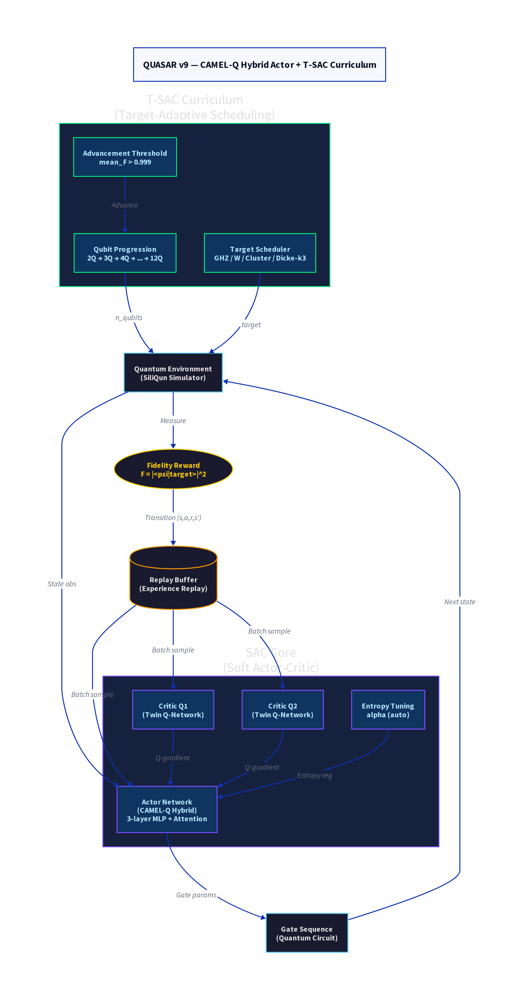

# QUASAR v9 — CAMEL-Q Hybrid Actor + T-SAC Curriculum

**Version:** v9  
**Codename:** CAMEL-Q  
**Status:** Completed (superseded by v19)  
**Repository:** [quasar-v9](https://github.com/r3d-phd/quasar-v9)  
**Date:** 2025  

---

## Overview

QUASAR v9 (Quantum-Adaptive SAC for Reinforcement Learning) represents the first major stable architecture in the QUASAR lineage. It introduces the **CAMEL-Q Hybrid Actor** — a Soft Actor-Critic (SAC) agent augmented with a context-aware attention mechanism — paired with a **T-SAC Curriculum** (Target-Adaptive Scheduling) that progressively advances the agent from 2-qubit to 12-qubit quantum state preparation tasks.

The central research question addressed by v9 is whether a model-free deep RL agent, operating directly on density matrix observations, can learn high-fidelity quantum gate sequences for entangled state preparation on silicon spin qubit hardware, without access to a quantum circuit compiler.

---

## Architecture

### Core Components

The architecture is organised into four primary subsystems, each with a well-defined interface.

**SAC Core.** The reinforcement learning backbone is a standard Soft Actor-Critic implementation with twin Q-networks (Q1, Q2) and automatic entropy tuning. The actor and critics are parameterised as 3-layer MLPs with hidden dimension 256. The entropy coefficient alpha is learned online by minimising a target entropy objective. The replay buffer holds up to 1 million transitions.

**CAMEL-Q Hybrid Actor.** The actor network is augmented with a lightweight self-attention head that operates over the flattened density matrix observation. This allows the actor to attend to correlations between qubit subsystems when computing gate parameters, which is particularly beneficial for multi-qubit entangled targets such as GHZ and Cluster states. The attention head adds approximately 12% parameter overhead relative to a plain MLP actor.

**T-SAC Curriculum.** The curriculum scheduler advances the training task along two axes: (1) qubit count, from 2Q to 12Q in unit increments, and (2) target family, cycling through GHZ, W, Cluster, and Dicke-k3. Advancement is gated by a threshold condition requiring mean fidelity F > 0.999 over a rolling evaluation window of 10 episodes. This ensures the agent has genuinely mastered the current task before being exposed to harder instances.

**Fidelity Reward.** The scalar reward at each timestep is the state fidelity F = |<psi|target>|^2, computed between the current density matrix and the target state. No shaped reward or auxiliary objectives are used in v9.

### Architecture Summary Table

| Component | Type | Hidden Dim | Layers | Notes |
|-----------|------|-----------|--------|-------|
| Actor | MLP + Attention | 256 | 3 + 1 attn | CAMEL-Q hybrid |
| Critic Q1/Q2 | MLP | 256 | 3 | Twin Q-network |
| Replay Buffer | Ring buffer | — | — | 1M transitions |
| Entropy alpha | Scalar | — | — | Auto-tuned |
| Curriculum | T-SAC | — | — | 2Q–12Q, 4 targets |

---

## Experimental Setup

Training was conducted on the SiliQun silicon spin qubit simulator, which models a linear chain of exchange-coupled spin-1/2 qubits with nearest-neighbour two-qubit gates and single-qubit rotations. The noise model in v9 is minimal (near-ideal), as the primary goal was to establish baseline fidelity before introducing realistic noise.

Seeds 42, 123, and 456 were used for all experiments. The maximum training budget per qubit level is 500,000 steps, scaled by a factor of 1.5 per additional qubit. The batch size is 256, learning rate 3e-4 for both actor and critics, discount factor gamma = 0.99, and soft update coefficient tau = 0.005.

---

## Key Results

QUASAR v9 achieves near-perfect fidelity on 2-qubit and 3-qubit targets (F > 0.999) but exhibits a performance ceiling at 4+ qubits, where fidelity drops to approximately 0.69–0.75. This ceiling motivates the stagnation recovery mechanisms introduced in v19.

| Qubits | GHZ | W | Cluster | Dicke-k3 | Mean F |
|--------|-----|---|---------|----------|--------|
| 2Q | 0.9999 | 0.9999 | 0.9709 | 1.0000 | 0.9927 |
| 3Q | 0.9641 | 0.8369 | 0.8973 | 1.0000 | 0.9246 |
| 4Q | 0.6891 | 0.5531 | 0.6012 | 0.7130 | 0.6641 |

The 4Q ceiling is attributed to two factors: (1) the absence of a stagnation recovery mechanism, causing the agent to plateau in local optima, and (2) the lack of noise-adaptive curriculum, which prevents the agent from building robustness to hardware-level decoherence.

---

## Limitations and Motivation for v19

The primary limitation of v9 is the absence of any mechanism to escape training stagnation. When the agent's fidelity plateaus for thousands of steps, there is no signal to trigger exploration or hyperparameter adaptation. This motivates the introduction of the SWDFT stagnation detector and the ERL-SLM escalation pipeline in v19.

A secondary limitation is the fixed reward function. BRFD (Bayesian Reward Function Discovery), introduced in v19, addresses this by learning reward weights online.

---

## Files and Artefacts

| File | Description |
|------|-------------|
| `quasar_v9/quasar_v9.py` | Main training script |
| `quasar_v9/results/` | JSON result files (2Q–4Q, seeds 42/123/456) |
| `quasar_v9_results.json` | Aggregated scalability report |

---

## Citation

If referencing this version, please cite the QUASAR paper and the SiliQun simulator:

> Alshehri, R. (2025). *QUASAR: Quantum-Adaptive Soft Actor-Critic for Reinforcement Learning-Based Quantum State Preparation on Silicon Spin Qubits*. PhD Thesis, King Abdulaziz University.
